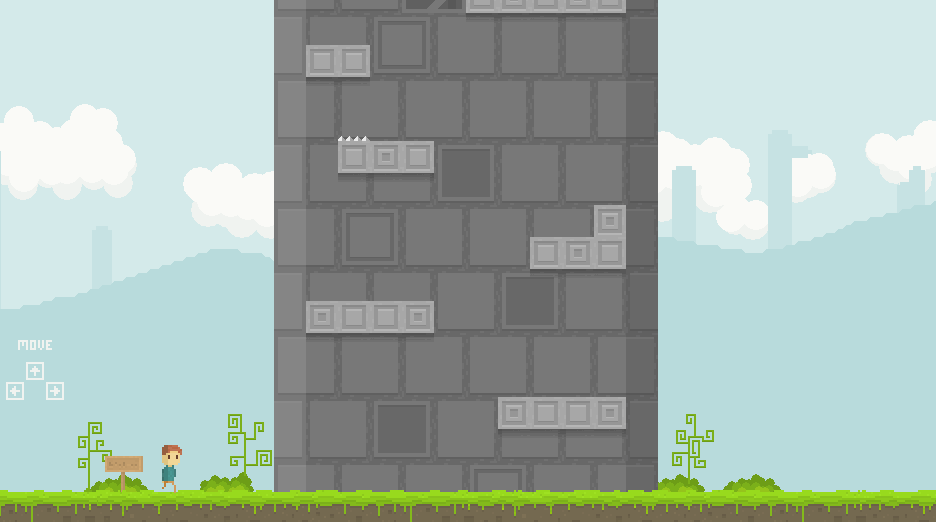

# Towos



A 2D Platformer I created for a high school project in 2015. Built in Haxe using the Flixel library which supports multiple platforms such as Windows, HTML5, Flash, Android, Mac, etc.

## How to install

Install [Haxe](https://haxe.org/).

Install Lime:

```bash
haxelib install lime 8.1.0
```

Run the following command:

```bash
haxelib run lime setup flixel
```

Compile with

```bash
# Windows
haxelib lime build windows
# Web
haxelib lime build html5
# Flash
haxelib lime build flash
# Android
haxelib lime build android
```

## Level Editing

There is one main level which can be edited using [Tiled](https://www.mapeditor.org/). The Tiled map project is located in [assets/tiled/level.tmx](./assets/tiled/level.tmx)
## Dependencies used

This updated current version used the following dependencies:

Haxe version: 4.3.2

- flixel:5.4.1
- flixel-addons:3.2.1
- lime:8.1.0
- openfl:9.3.1